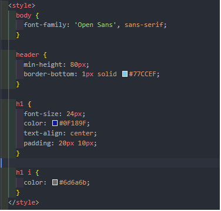

# Lab2web

Dasar - dasar CSS

## Praktikum 2

1. pertama kita buat dulu struktur `HTML`

2. membuat tampilan dasar 

kemudia save dan refres browser

3. menambahkan deklarasi css internal

Internal CSS adalah kode CSS yang ditulis dalam tag <style> dan lokasinya berada pada bagian atas header file HTML. Internal CSS digunakan untuk membuat custom khusus dalam satu halaman website sehingga halaman lain tidak terpengaruh.

4. menambahkan deklarasi CSS inline

Inline CSS adalah memasukan kode CSS yang ditulis secara langsung pada setiap atribut HTML. Jadi setiap atribut memiliki style CSS yang berbeda tergantung kebutuhan . Inline CSS ini tergolong kurang efisien jika dibandingkan jenis CSS untuk website lainnya

    

        maka paragraf nya akan berubah

5. membuat CSS eksternal

External CSS adalah kode CSS yang penulisannya dipisah dengan file HTML. Jadi file CSS ditulis pada file sendiri dengan ekstensi .css. File External CSS biasa dituliskan pada bagian , jadi setiap halaman website dilakukan pemanggilan file css.

pertama kita membuat file css dengan nama `style_eksternal.css`

        <link rel="stylesheet" href="style_eksternal.css">

merubah navigasi

maka akan tampil sebagai berikut

6. menambhakan CSS selector

CSS selector adalah salah satu rule set dari Css yang fungsinya tidak berbeda jauh dengan namanya (Selector) yakni memilih suatu elemen yang ingin anda beri gaya atau style css. Universal selector berarti memilih semua elemen yang ada pada suatu halaman HTML

maka tampilan nya akan berbah

